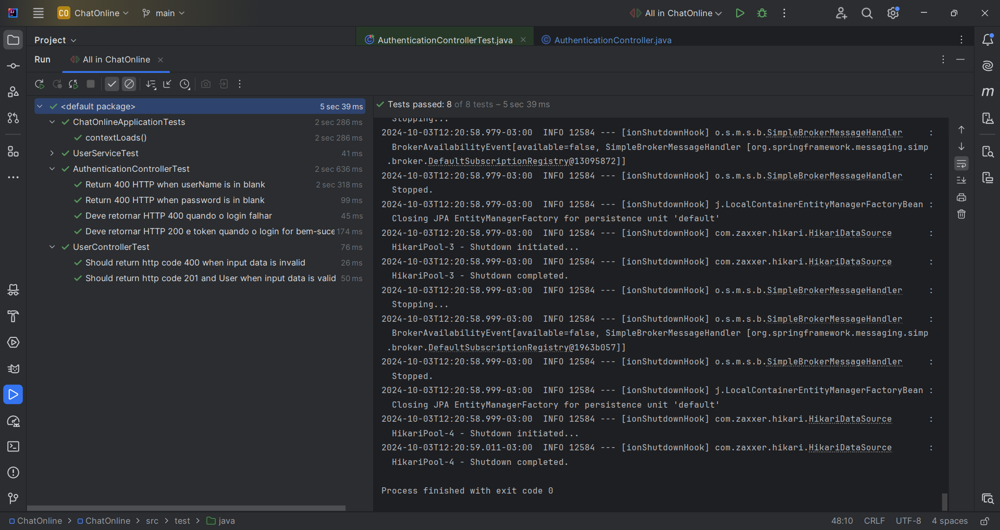

# ChatOnline 👩‍💻

**ChatOnline** é uma aplicação de chat em tempo real desenvolvida utilizando Java e WebSocket para o backend. HTML, CSS, JavaScript para o frontend. A aplicação permite a comunicação instantânea entre usuários, oferecendo uma experiência de chat interativa.

## Funcionalidades

- **Chat em Tempo Real**: Comunicação instantânea entre usuários conectados.
- **Autenticação**: Sistema de login para gerenciamento seguro de sessões.
- **Envio de Mensagens e Arquivos**: Suporte planejado para envio de mensagens de texto e arquivos.
- **Histórico de Mensagens**: Armazenamento e visualização de mensagens anteriores (funcionalidade futura).
- **Reações com Emoji**: Adição de emojis para reações nas mensagens (funcionalidade futura).
- **Criptografia com WSS**: WebSocket seguro para proteção das comunicações (funcionalidade futura).

## Tecnologias Utilizadas

### Backend

- **Java**: Linguagem de programação principal.
- **WebSocket**: Protocolo para comunicação em tempo real.
- **Spring Boot**: Framework para construção e configuração da aplicação.

### Frontend

- **HTML**: Estrutura básica da aplicação.
- **CSS**: Estilização da interface.
- **JavaScript**: Funcionalidades interativas.

## Estrutura do Banco de Dados

As tabelas do banco de dados necessárias para a aplicação são as seguintes:

```sql
-- Criação da tabela users
CREATE TABLE users (
    id BIGINT AUTO_INCREMENT PRIMARY KEY,
    userName VARCHAR(50) NOT NULL UNIQUE,
    password VARCHAR(255) NOT NULL,
    created_at TIMESTAMP NOT NULL DEFAULT CURRENT_TIMESTAMP
);

-- Criação da tabela messages
CREATE TABLE messages (
    id BIGINT AUTO_INCREMENT PRIMARY KEY,
    sender_id BIGINT NOT NULL,
    receiver_id BIGINT NOT NULL,
    content TEXT,
    created_at TIMESTAMP NOT NULL DEFAULT CURRENT_TIMESTAMP,
    CONSTRAINT fk_sender
        FOREIGN KEY (sender_id)
        REFERENCES users(id)
        ON DELETE CASCADE,
    CONSTRAINT fk_receiver
        FOREIGN KEY (receiver_id)
        REFERENCES users(id)
        ON DELETE CASCADE
);

-- Criação da tabela media
CREATE TABLE media (
    id BIGINT AUTO_INCREMENT PRIMARY KEY,
    user_id BIGINT NOT NULL,
    message_id BIGINT,
    file_path VARCHAR(255) NOT NULL,
    file_type VARCHAR(50) NOT NULL,
    uploaded_at TIMESTAMP NOT NULL DEFAULT CURRENT_TIMESTAMP,
    CONSTRAINT fk_user
        FOREIGN KEY (user_id)
        REFERENCES users(id)
        ON DELETE CASCADE,
    CONSTRAINT fk_message
        FOREIGN KEY (message_id)
        REFERENCES messages(id)
        ON DELETE SET NULL
);
```

## Como Funciona o Backend

O backend da aplicação utiliza Java e Spring Boot para gerenciar as comunicações em tempo real através do protocolo WebSocket. Aqui está um resumo das principais funcionalidades do backend:

- Autenticação de Usuários: Utiliza Spring Security para autenticar os usuários. O sistema de autenticação garante que apenas usuários registrados possam acessar as funcionalidades do chat.
- Gerenciamento de Conexões: O backend gerencia as conexões WebSocket, permitindo que múltiplos usuários se conectem e troquem mensagens em tempo real.
- Processamento de Mensagens: As mensagens enviadas pelos usuários são processadas e retransmitidas para todos os usuários conectados. Isso garante que todos recebam as mensagens instantaneamente.
- Segurança: As comunicações são protegidas utilizando WebSocket seguro (WSS), garantindo que as mensagens trocadas entre os usuários permaneçam privadas.

## Como Executar a Aplicação

Pré-requisitos

- Java 21 ou superior
- Maven
- MySQL ou outro banco de dados de sua preferência, caso seja outro, atualize a dependência no pom.xml.
- **Frontend**: O frontend da aplicação deve estar em execução. Você pode encontrar o repositório do frontend em [link do repositório do frontend](https://github.com/euvitorti/chatFront).
- Clone o repositório:

```
git clone https://github.com/euvitorti/chatonline.git
cd chatonline
```

Configure a aplicação:

- Abra src/main/resources/application.properties.
- Atualize a configuração do banco de dados com suas credenciais:

```
spring.datasource.url=jdbc:mysql://localhost/seu_banco_de_dados
spring.datasource.username=seu_usuario
spring.datasource.password=sua_senha
```

## Configuração do CORS
Acesse a classe Security e localize o método responsável pela configuração do CORS. Atualize a linha de código que define a URL permitida com a URL onde o front-end está rodando (seja em ambiente de desenvolvimento ou produção).

Exemplo de configuração de CORS em uma classe de configuração Java:
```
    @Override
    public void addCorsMappings(CorsRegistry corsRegistry) {
        corsRegistry.addMapping("/**") // Allow CORS for all endpoints
                .allowedOrigins("http://127.0.0.1:5500") // Specify allowed origins
                .allowedMethods("GET", "POST", "PUT", "DELETE", "OPTIONS") // Specify allowed HTTP methods
                .allowedHeaders("*") // Allow all headers
                .allowCredentials(true); // Allow credentials to be included in CORS requests
    }
```

### Acesse socket/server/WebSocketConfig.java

```
    @Override
    public void registerStompEndpoints(StompEndpointRegistry registry) {
        // Registering STOMP endpoints for WebSocket connections
        registry.addEndpoint("/ws")
                .setAllowedOrigins("http://127.0.0.1:5500") // Allowing specific origins for CORS
                .withSockJS(); // Enabling SockJS fallback options
    }
```

Substitua "http://127.0.0.1:5500" pela URL correta onde o front-end está rodando, por exemplo:

Desenvolvimento local: http://127.0.0.1:5501

Produção: A URL do seu servidor de produção.

Isso vai garantir que o front-end consiga acessar a API corretamente!

Execute o back e acesse a aplicação com o front, na página signin.html.

## Documentação da API

A documentação da API está disponível via Swagger UI. Você pode acessá-la em:

```
http://localhost:8080/swagger-ui.html
```

## Testes

O backend do projeto, desenvolvido em Java, inclui classes de teste para garantir a funcionalidade e a qualidade do código. Os testes atualmente abrangem:

- **Autenticação**: Verifica se o sistema de autenticação está funcionando corretamente.
- **Criptografia de Senha**: Testa a implementação da criptografia para garantir que as senhas dos usuários sejam armazenadas de forma segura.
- **Salvar Usuário no Banco de Dados**: Confirma que os usuários são salvos corretamente no banco de dados.

Embora esses testes estejam em funcionamento, o projeto ainda não está completamente finalizado. Mais testes serão implementados para garantir a robustez e a confiabilidade do sistema.



### Notas

- Sinta-se à vontade para fazer mais ajustes, adicionar informações ou personalizar detalhes conforme necessário. Se precisar de mais alguma coisa, estou à disposição!
